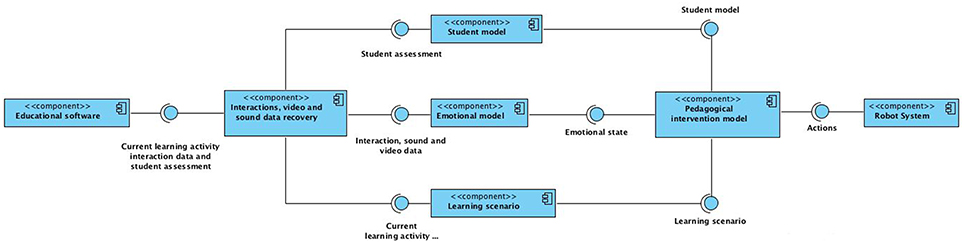

# Introduction

ARTIE \(Affective Robot Tutor Integrated Environment\) is an architectural pattern which integrates any given educational software for primary school children with a component whose function is to identify the emotional state of the students who are interacting with the software, and with the driver of a robot tutor which provides personalized emotional pedagogical support to the students.

The components of the architecture are:

* [Client](artie-client/artie-client-introduction.md)
* Student model
* Emotional model
* Learning scenario
* Pedagogical Intervention model
* Robot system

