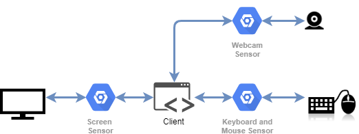

# ARTIE Client

ARTIE Client is the component whose function is to gather information about the user \(facial images, mouse and keyboard interactions,...\) and then to send it to ARTIE architecture. This client is composed by a central application \(the client\) and by modules \(sensors\).

All the components of this architecture are based in Springboot 2.

In ARTIE all the sensors have been followed an archetype, and an interface included in the ARTIE Common libraray,  to be integrated in the client:

* [ARTIE Common library](https://github.com/ARTIEROCKS/artie-common.git)
* [ARTIE Sensor archetype](https://github.com/ARTIEROCKS/artie-sensor-archetype.git)

You can find the ARTIE Client in this repository: [ARTIE Client](https://github.com/ARTIEROCKS/artie-client.git).

Currently, the following ARTIE Sensors have been developped:

* [Keyboard and Mouse Sensor](https://github.com/ARTIEROCKS/artie-sensor-keyboard-mouse.git).
* [Screen Sensor](https://github.com/ARTIEROCKS/artie-sensor-screen.git).
* [Webcam Sensor](https://github.com/ARTIEROCKS/artie-sensor-webcam.git).

