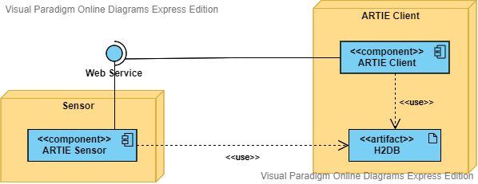

# Sensor architecture

## Introduction

Sensors are modules that are used to collect information from devices.  
  
These sensors can work in a isolated way, so that through a webservice you can consult the information they have collected, or in communication with the ARTIE client, in which sensor will send its information to a in-memory-database available in the ARTIE Client instance.  
  
In order to standardize the sensors, and for the ARTIE client to be able to communicate with them, these sensors must implement an interface available in the ARTIE Common Sensor library.

## Sensor Interface

### Isolated mode

### Client communication mode

